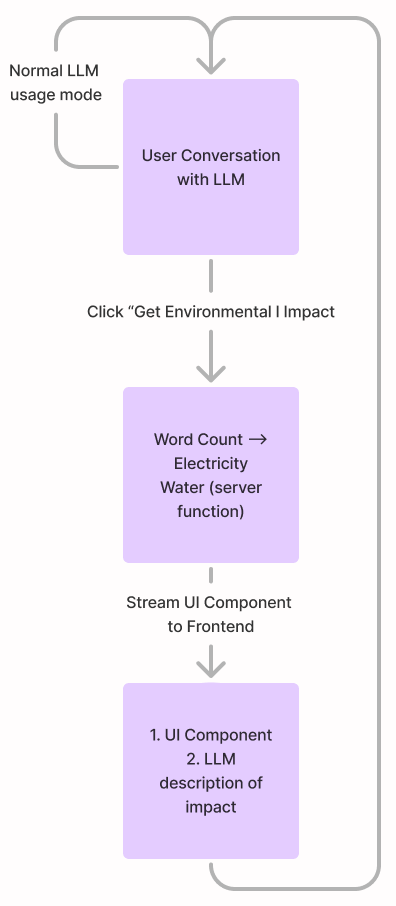

# How Thirsty is Your LLM?
___
## Introduction
Understand the estimated water and electricity consumption of your AI powered conversations.

### Tech Stack

| **Technology**                                               | **Description**                                                         |
| ------------------------------------------------------------ | ----------------------------------------------------------------------- |
| [**Vercel AI-SDK Chatbot Template**](https://vercel.com/templates/next.js/nextjs-ai-chatbot)                           | Template for building AI-powered chatbots with Vercel                   |
| **Next.JS + React**                                          | JavaScript frameworks for building dynamic web applications             |
| **Tailwind + Shadcn/ui**                                     | Utility-first CSS framework + component library for UI                  |
| **OpenAI GPT-4o**                                            | Large Language Model used for conversational AI + LLM Tool Use          |
| **Vercel CI/CD deployments integration with Github Actions** | Continuous Integration and Deployment through Vercel and Github Actions |
| **Vercel Postgres Relational Database**                      | Managed Postgres database on Vercel for data storage                    |
| **Vercel Blob Storage**                                      | Cloud storage for storing and serving files                             |
### Table of Contents
- [What is How Thirsty is your LLM?](#what-is-how-thirsty-is-your-llm)
- [Why Individual Impact?](#why-individual-impact)
- [How do I use Thirsty LLM "properly"?](#how-do-i-use-thirsty-llm-properly)
- [Motivation](#motivation)
- [Difficulty in Estimations](#difficulty-in-estimations)
- [Future Considerations](#future-considerations)
- [Technical Details (for Geeks)](#technical-details-for-geeks)
- [Citations](#citations)

___
## What is How Thirsty is your LLM?
The `How Thirsty is your LLM?` project (or `Thirsty LLM` for short) aims to visualize the immense water and electricity usage of Large Language Models (LLMs)

`Electricity consumption` comes from the computers needed to power the LLMs.

`Water consumption` comes from the fresh water used to cool the computers needed to power the LLMs.
___
## Why Individual Impact?
This project focuses on quantifying the environmental impact of a single user's (that's you!) to make the large environmental impact of just a single user hit home.

That's why while we measure the impact in milliliters (mL) and kilo-watt-hours (kWh) we also measure the resource draw in relatable measurements (i.e. # of Coke Cans, # of AA Batteries, # of Light Bulbs powered for 1 hour)
___
## How do I use Thirsty LLM "properly"?
There's no right or wrong way to use this project!  
Simply chat with this [Vercel AI-SDK](https://vercel.com/templates/next.js/nextjs-ai-chatbot) implementation of [OpenAI's GPT-4o](https://openai.com/index/hello-gpt-4o/) like you would with ChatGPT.

When you're ready to see the environmental impact, press the `Get Environmental Impact` button to see the estimated environmental draw.
___
## Motivation
AI is here to stay.

As LLMs and chatbots continue to become more prevalent, this project aims to spread awareness and urgency for the development of research and technological innovations to make LLM (training, inference, and pipeline) more environmentally friendly.

Thus, this project is **not** calling for the end of AI and LLMs, rather it is meant to inspire the next generation of engineers, innovators, and society as a whole to work on improving the environmental sustainability of this groundbreaking technology as a united collective.

<small>*Perhaps the AI and LLM environmental challenge will be part of a larger movement helping to connect people from all walks of life...*</small>
___
## Difficulty in Estimations
The environmental impact of LLMs is quite difficult to estimate because:

1. LLMs are blackboxes (Closed Source)
2. LLMs are distributed (across the globe)
3. LLMs are parallel processing architectures

---

**1. LLMs are blackboxes**

Most LLMs like OpenAI's ChatGPT are closed source, meaning that we have no access to the code used to run these models—making it quite difficult to reproduce 3rd party monitoring of resource consumption.

This requires researchers to rely on self-reporting in order to estimate LLM impact.

---

**2. LLMs are distributed**

Like many large-scale software systems, LLMs are "distributed", meaning that instances (copies) of LLMs are replicated in data centers across the globe.

For electricity, the environmental impact of LLM usage will vary depending on the location, energy efficiency, and energy availability of the power plant powering the data center the LLM "lives in".

For water, the environmental impact of LLM usage will vary depending on the data center's access to water and the ambient temperature. Since hotter areas require more cooling and thus more water, a data center in Arizona would consume more water than a hypothetical data center in Alaska.

Since it's not possible to know where models are being hosted for a specific conversation, we rely on simplifying assumptions about baseline water and electricity usage.

---

**3. LLMs Process in Parallel**

One of the main reasons why LLMs are so powerful is because they leverage the [Transformer Architecture](https://arxiv.org/abs/1706.03762) which allows many of the computations to be in parallel on specialized hardware known as Graphical Processing Units (GPUs).

Thus, LLMs process "batches" or many conversations simultaneously—making it difficult to estimate the environmental impact of a single conversation.

---

<small>*Note: Since we are focusing on the individual impact of user conversations with LLMs, we do not factor in the large amount of water and electricity needed to train the models and calculate only for model inference.*</small>
___
## Future Considerations
LLM companies such as OpenAI and Anthropic are seeing boosts in model performance through larger models according to [scaling laws](https://arxiv.org/abs/2001.08361)—the idea that larger models have a predictable increase in improvement. However, the danger is that model size increase is also strongly indicative of LLM resource draw.

Yet, as policy and the AI field continues to evolve, such as advances in cooling and GPU chip technology, the environmental impact of LLMs has the potential to become more environmentally friendly.

As a specific example, `Hugging Face` policy primer, [The Environmental Impacts of AI — Primer](https://doi.org/10.57967/hf/3004), also explains that strategies such as choosing smaller task-specific LLMs versus larger multi-task LLMs and flexible training schedules can decrease CO2 emissions.
___
## Technical Details (for Geeks)
This project is built on the [Vercel AI-SDK Chatbot Template](https://vercel.com/templates/next.js/nextjs-ai-chatbot) with custom LLM tool functions for estimating the environmental impact.

In the default state of the Model View Controller (MVC), the user interacts with the app in "Chat mode". Once the `Get Environmental Impact` button is pressed, the app prompts the LLM to call the custom `getEnvironmentalImpact` tool which calculates the estimated electricity and water draw based on the running word count of the System Prompt, user messages, and tool response.

For deployment, authentication, and datastore, we use the Vercel platform's built-in CI/CD, Postgres Relational Database, and Vercel Blob storage.
___
## Citations
1. Kaplan, J., McCandlish, S., Henighan, T., Brown, T. B., Chess, B., Child, R., Gray, S., Radford, A., Wu, J., & Amodei, D. (2020). *Scaling Laws for Neural Language Models*. arXiv: [2001.08361](https://arxiv.org/abs/2001.08361)

2. Li, P., Yang, J., Islam, M. A., & Ren, S. (2023). *Making AI Less “Thirsty”: Uncovering and Addressing the Secret Water Footprint of AI Models*. arXiv preprint arXiv: [2304.03271](https://arxiv.org/abs/2304.03271)

3. Luccioni, S., Trevelin, B., & Mitchell, M. (2024). *The Environmental Impacts of AI — Policy Primer*. Hugging Face, [https://doi.org/10.57967/hf/3004](https://doi.org/10.57967/hf/3004)

4. Vaswani, A., Shazeer, N., Parmar, N., Uszkoreit, J., Jones, L., Gomez, A. N., Kaiser, Ł., & Polosukhin, I. (2017). *Attention Is All You Need*. arXiv preprint arXiv: [1706.03762](https://arxiv.org/abs/1706.03762)

5. Verma, P., & Tan, S. (2024). *A Bottle of Water Per Email: the Hidden Environmental Costs of Using AI Chatbots*. Washington Post. [www.washingtonpost.com/technology/2024/09/18/energy-ai-use-electricity-water-data-centers/](https://www.washingtonpost.com/technology/2024/09/18/energy-ai-use-electricity-water-data-centers/)
